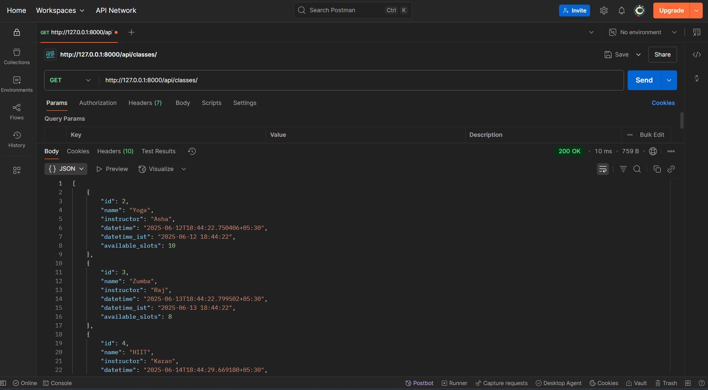

# Fitness Studio Booking API
A simple Booking API built with Django and Django REST Framework for a fictional fitness studio offering Yoga, Zumba, and HIIT classes.

# Features
- View all upcoming fitness classes
- Book a class (with validation and available slots check)
- View bookings by client email
- Timezone-aware (IST by default)
- Edge case handling (e.g., overbooking, missing fields)
- Logging for requests
- Unit tests included

# Setup Instructions

# 1. Clone the Repository
git clone https://github.com/your-username/fitness-booking-api.git
cd fitness-booking-api

# 2. Create Virtual Environment
python -m venv venv
source venv/bin/activate

# 3. Install Dependencies
pip install -r requirements.txt

# 4. Apply Migrations
python manage.py makemigrations
python manage.py migrate

# 5. Seed Sample Data
python manage.py shell

Paste:
from api.models import FitnessClass
from django.utils import timezone
from datetime import timedelta

FitnessClass.objects.create(name='Yoga', instructor='Asha', datetime=timezone.now() + timedelta(days=1), available_slots=10)
FitnessClass.objects.create(name='Zumba', instructor='Raj', datetime=timezone.now() + timedelta(days=2), available_slots=8)
FitnessClass.objects.create(name='HIIT', instructor='Karan', datetime=timezone.now() + timedelta(days=3), available_slots=5)

# 6. Run the Server
python manage.py runserver

# The Below is an Example for Postman Request
